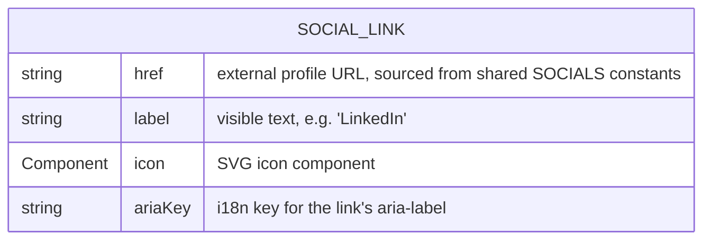
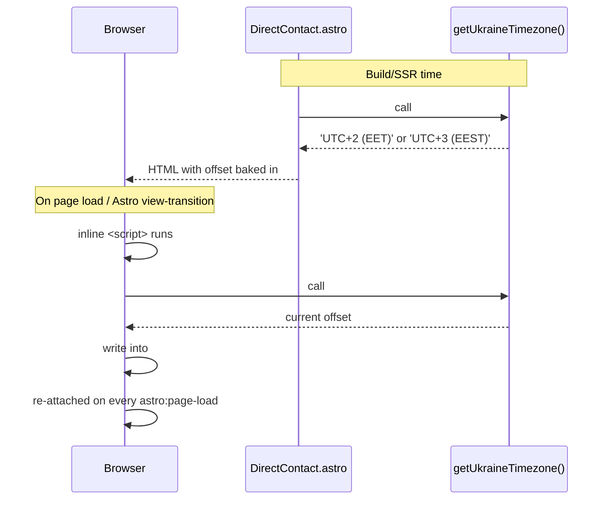

# Contacts

## Purpose

The contacts page is how a visitor reaches Oleh after being convinced by the rest of the portfolio. It frames the audience (recruiters/hiring managers, consulting contacts, fellow engineers) via an intro, then gives three ways to act: direct contact details (email, Telegram, location with live local time), a row of professional social links (LinkedIn, GitHub, Telegram), and a closing CTA that loops back to the CV / experience timeline rather than ending the journey.

## Data model

`SOCIAL_LINK` (`@shared/interfaces`) backs the static `SOCIAL_LINKS` array (`social-links/social-links.ts`) — three fixed entries (LinkedIn, Telegram, GitHub), no persistence, no relations to other entities.

## Sequence diagram

Single flow: the Ukraine UTC offset shown next to the location is computed once server-side for the initial paint, then re-computed client-side on load and again on every `astro:page-load` (Astro view-transitions navigation), so it can't go stale on a long-open tab or a client-side route change.

## Implementation nuances

- The offset is derived via `Intl.DateTimeFormat` against the `Europe/Kyiv` IANA zone (`direct-contact/get-ukraine-timezone.ts`), not hand-rolled DST math — correct regardless of the host's own timezone (e.g. UTC on serverless) and survives future DST rule changes. DST boundary behavior (flips at 01:00 UTC on the EU's last-Sunday-of-March/October transitions) is covered by `get-ukraine-timezone.unit.ts` with fake-timer tests.
- Telegram appears twice with different treatment: a direct-contact card showing the hardcoded plain-text handle `@khavol` (no i18n key), and a `SOCIAL_LINKS` icon card with an i18n aria-label. This is two intentional presentations of the same channel, not a duplication bug.
