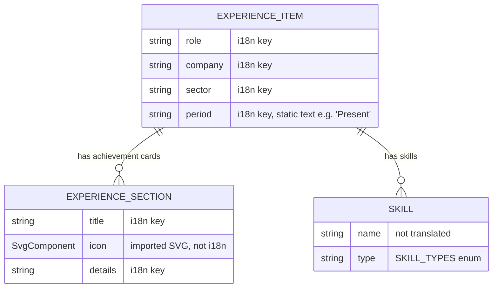

# Experience

## Purpose

The `/experience` page section for visitors evaluating Oleh's professional background. Renders, top to bottom: an intro statement (`ExperienceIntro`), a reverse-chronological career timeline (`TimelineCareer`) with one card-pair per role (role/company/skills on one side, achievement write-ups on the other), and a closing call-to-action (`CallToAction`) pointing to the CV download and the projects page. Entirely static, authored content — no user interaction beyond following the CTA links.

## Data model

## Implementation nuances

- `TimelineCareer` renders `EXPERIENCE_DATA` in array order with no sorting — **the array's order _is_ the display order**. The most recent role is listed _first_ in the array, even though its i18n key prefix (`experience_2_*`) is numerically the highest. Adding a new role means prepending it to the array, not appending.
- The timeline's left/right "zigzag" look is fixed CSS (`md:grid-cols-2`, `md:text-right`) applied identically to every entry — it is **not** an alternating layout computed per item. Every entry has the role/company/skills card in the same column and the achievement cards in the other.
