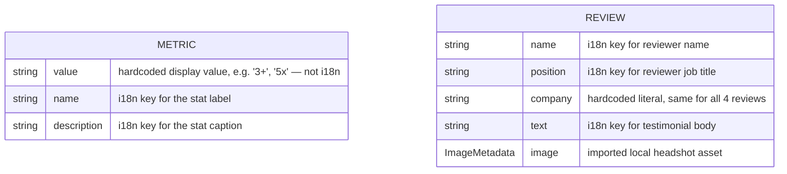
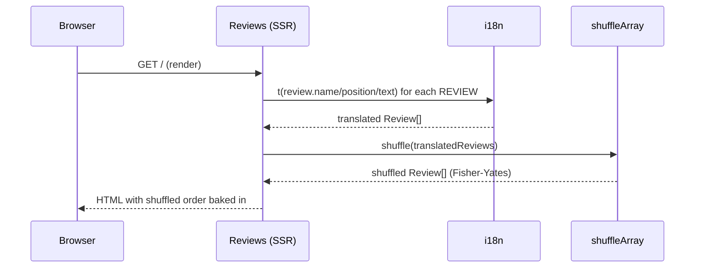

# Home

## Purpose

The landing page (`/`). Introduces Oleh Khavar to a visitor in four stacked sections, top to bottom:

- **Hero** — name, headshot, title, and a one-paragraph pitch.
- **Goal** — a summary of focus areas with CTA buttons routing to the Experience and Projects pages.
- **Metrics** — four headline stats (years of experience, performance gain, team size, delivery model) as a quick-scan credibility strip.
- **Reviews** — a carousel of LinkedIn-sourced colleague testimonials, with a link out to all recommendations on LinkedIn.

## Data model

`Metric` and `Review` are independent — no relation between them. Each is a flat, hardcoded array (`METRICS`, `REVIEWS`) with no backing store or CMS.

## Sequence diagram

Reviews are translated then shuffled **once per server render** — order is fixed for that response but varies between requests/reloads.

## Implementation nuances

- **Metrics are static, untranslated values paired with translated labels**: `value` is a hardcoded string in `metrics-data.ts`; only `name`/`description` go through i18n. Updating a stat means editing the data file, not the i18n dict.
- **The carousel has no JS framework** — it's daisyUI's CSS `carousel` plus an inline `<script>` wiring `click` → `scrollIntoView` on each prev/next button, using a `data-target` id computed at render time with wraparound (last slide's "next" → slide 0, slide 0's "previous" → last slide).
- Carousel click handlers are re-bound on `astro:page-load` (Astro view-transitions), in addition to first load, since the inline script body only runs once per real navigation otherwise.
- Review `name`/`position`/`text`/`image` are 1:1 per entry — swapping a testimonial's photo means editing `reviews-data.ts`, not just the i18n dict.
