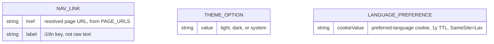
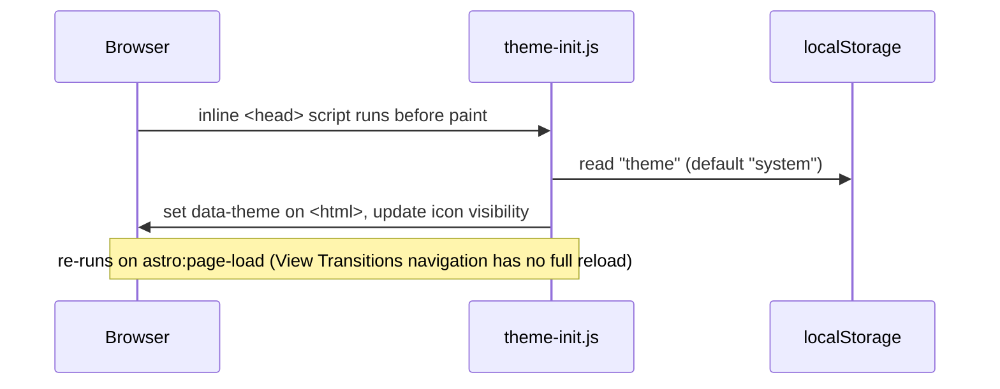
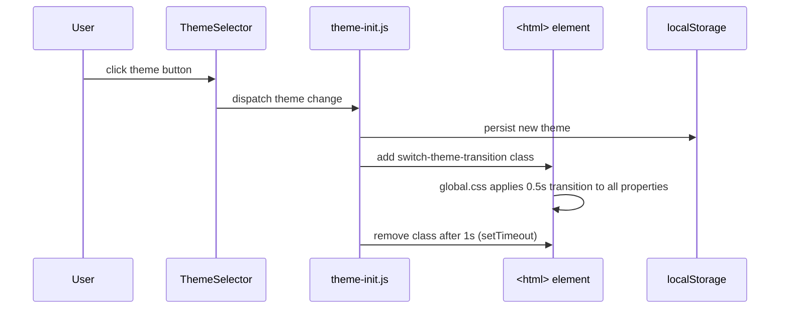
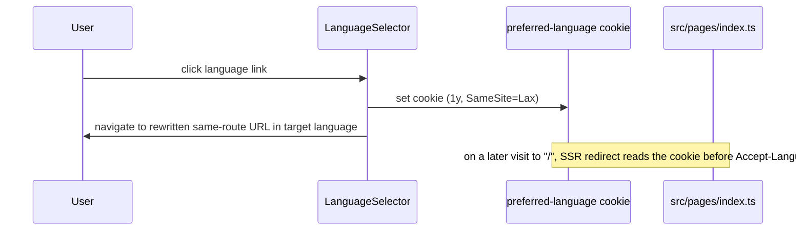

# Layout

## Purpose

Site-wide shell every page renders into: header navigation (desktop navbar + mobile drawer/sidebar), footer with legal/social links, SEO/meta tag injection, and the language and theme switchers. Visible on every page, for every visitor; it's the only feature slice every page composes directly.

## Data model

No relations between them — each is an independent, statically-defined config shape (`NAVIGATION_LINKS`, `THEMES`, the language cookie), not a persisted/linked entity.

## Sequence diagram

No-flash theme application on every load/navigation.

User-initiated theme switch with an animated transition.

Explicit language choice persisted across visits to the root redirect.

## Implementation nuances

- **`no-transitions` vs `switch-theme-transition` are opposite intents on the same element**: `remove-transitions.js` adds `no-transitions` (forces `transition: none !important`) on every `astro:page-load` (including first load) for 1s, to suppress transitions during page navigation/hydration. `theme-init.js` adds `switch-theme-transition` only when the user explicitly changes the theme. Both classes can theoretically be present; `no-transitions` is the broader override and exists to stop layout transitions from running during route changes, not theme changes.
- **Theme icon sync without a framework**: `ThemeSelector.astro` renders all three theme icons hidden by default; `theme-init.js`'s `updateThemeIcon` toggles visibility based on current theme, independent of Astro's render — the icon state lives entirely in vanilla JS, re-run on every `astro:page-load`.
- **`getLanguageUrl` (language-selector) rewrites the _current_ path's language prefix** (swaps `pathParts[0]` if it's a known lang code, else prepends), so switching language preserves the rest of the route — distinct from the unrelated `@shared/helpers` `getLanguageUrl` used by nav links to build same-language URLs.
- **Active nav link detection** compares `Astro.url.pathname` against the link's resolved URL exactly (`===`), so it only matches exact route matches, not prefix matches.
- **Sidebar focus trap**: the mobile drawer's close button and last nav link wire `Tab`/`Shift+Tab` manually to keep focus cycling within the open drawer (no native `<dialog>`/focus-trap library used).
- **SEO** (`Seo.astro`) auto-derives `hreflang` alternates and `og:locale`/`twitter:*` tags from `SUPPORTED_LANGUAGES`/`DEFAULT_LANGUAGE` and the current path with any language prefix stripped — page components only pass `title`/`description`/`noindex`.
- Skip link / drawer wiring relies on a hidden checkbox (`#mobile-drawer`) + daisyUI `.drawer` pattern, not JS state, for the open/closed toggle itself; JS only handles keyboard affordances and icon/theme side effects.
- `theme-init.js` and `remove-transitions.js` re-attach listeners idempotently: theme buttons use a `data-theme-bound` flag to avoid double-binding across repeated `astro:page-load` firings.
- If the URL has no language prefix and no path (`/`), `getLanguageUrl` (language-selector) returns `/<targetLang>/`; if it has extra path segments but no recognized lang prefix, it prepends the language rather than overwriting anything.
