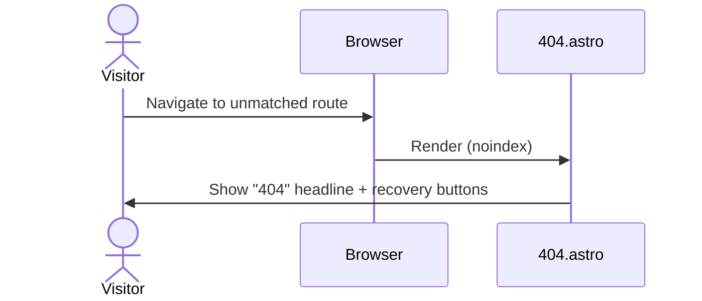
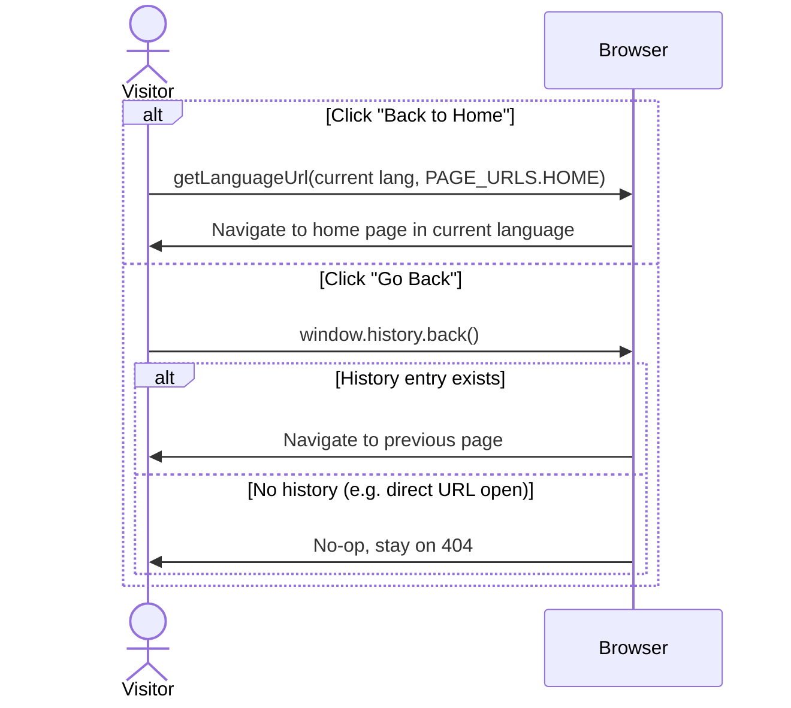

## Purpose

Shown to a visitor who lands on a route that doesn't exist (`src/pages/404.astro`). Tells them the page is missing and gives two ways to recover: go to the home page, or go back to wherever they came from. Composed of two sub-slices — `not-found` (the "404" headline + message) and `back-buttons` (the two recovery actions) — rendered together by the 404 page. Localized in EN/UK.

## Sequence diagram

Single render-time flow — no server logic branches.

The two recovery buttons are independent client-side actions, not part of the render flow above.

## Implementation nuances

- "Go Back" is a plain `window.history.back()` inline `onclick` on a `Button` — not a link, not language-aware (browser history navigation, not routing), and has no fallback if there's no history entry: it just no-ops.
- "Back to Home" uses `getLanguageUrl(Astro.url, PAGE_URLS.HOME)`, so it always lands on the home page in the _current_ language.
- `404.astro` sets `noindex={true}` on `Layout`, keeping the page out of search engines.
- The bouncing "404" headline animation (`animate-bounce-slow`) is a component-scoped `<style>` block in `NotFound.astro`, not a shared/Tailwind utility — only exists here.
