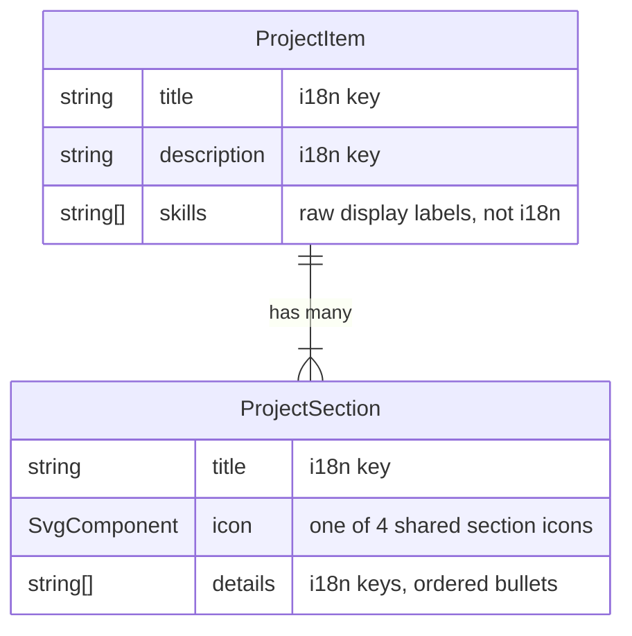

# Projects

## Purpose

Shows visitors an in-depth case-study view of two showcased projects — this **Portfolio** site itself, and **Forge Mock** (an architectural POC for a mock-data platform). Each project is rendered as a card broken into a goal/approach/features/value section grid, a tech-stack breakdown, and a link to the source on GitHub. `ProjectsIntro` renders the page's intro headline above both cards. The data behind each project (copy keys, icons, skills, section order) is authored once as a static `ProjectItem` object and consumed by a dedicated renderer component (`Portfolio.astro` / `ForgeMock.astro`).

## Data model

## Implementation nuances

- `Portfolio.astro` and `ForgeMock.astro` are near-identical renderers; the only structural difference is Portfolio additionally renders a "Lighthouse Performance Proof" block (`PERFORMANCE_METRICS`, 4 static labels) with a hardcoded `100` score per metric — these scores are asserted in markup, not computed from any real Lighthouse run.
- Both projects reuse the same 4 section icons (`target`, `settings`, `stars`, `business` in `projects/icons/`) — the icon-per-section mapping is just authoring convention (goal → target, approach → settings, features → stars, value → business), not enforced by any type or schema.
- `GitHubButton`'s `url` prop is hardcoded inline per project (`Portfolio.astro` → `github.com/Khavoleh/portfolio`, `ForgeMock.astro` → `github.com/forge-mock`) rather than sourced from `forge-mock/constants.ts` or a shared constant — easy to miss when the repo URL changes.
- Forge Mock's i18n copy explicitly frames it as a partially-built POC ("initial development and architectural setup were completed... establishing a framework for future feature implementation"); several "Key Architectural Objectives" bullets describe planned, not shipped, functionality.
- `TechStack` renders all skills flat with no category grouping/labels — every `SkillBlock` is a plain neutral badge, uniform across all skills.
